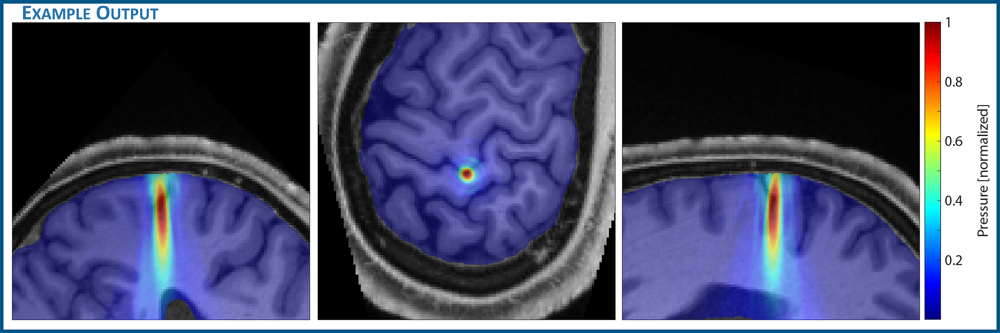

# TUSX

***A toolbox for acoustic simulations of transcranial ultrasound***

TUSX (Transcranial Ultrasound Simulation Toolbox) is an open-source MATLAB toolbox to perform acoustic simulations using subject-specific medical images for transcranial ultrasound experiments. TUSX consists of an integrated processing pipeline that takes in structural MRI (magnetic resonance) or CT (computed tomography) head images, processes them for accurate simulation, and runs the simulations using [k-Wave](http://k-wave.org), an existing open-source acoustics toolbox for MATLAB and C++.



- **Who will use TUSX?**
  - Presumably researchers performing transcranial ultrasound experiments. TUSX was written specifically with transcranial ultrasound stimulation (TUS) researchers in mind (i.e. those who use ultrasound as a non-invasive brain stimulation technique). However, TUSX should be useful for anyone who want to simulate the propagation of ultrasonic waves through the skull and brain.
- **What is the goal of TUSX?**
  - To make performing accurate acoustic simulations of transcranial ultrasound easier.

# Installing

TUSX written in MATLAB. As such, download TUSX and add TUSX to your [MATLAB seach path](https://www.mathworks.com/help/matlab/matlab_env/what-is-the-matlab-search-path.html).

If you have Git, download TUSX by cloning TUSX:

```shell
git clone https://github.com/ianheimbuch/tusx.git
```

Alternatively, a ZIP of the current version of TUSX can be downloaded via GitHub on a web browser.
>**Code** -> **Download ZIP**

## k-Wave
[**k-Wave**](http://k-wave.org) is a powerful open-source toolbox to perform computationally efficient acoustic simulations in MATLAB and C++ developed by Bradley Treeby and Ben Cox (University College London) and Jiri Jaros (Brno University of Technology). TUSX uses k-Wave to run acoustic simulations, so one must install k-Wave and add it to the MATLAB search path to use TUSX. k-Wave can be downloaded for free on their [website](http://k-wave.org). **Please cite k-Wave** if you perform acoustic simulations with the help of TUSX.

# Getting started

## Preparing simulation from NIfTI volume
The central function in TUSX is [`tusx_sim_setup`](sim/tusx_sim_setup.m):

```matlab
[kgrid, medium, source, sensor, input_args] = tusx_sim_setup(skullMask_filename, scVox, cxVox, scale, alphaPower)
```
### Parameters:
* `skullNifti`: File path to NIfTI file of binary skull volume (i.e. skull mask).
* `scalpLocation`: 3-element array of NIfTI voxel coordinates (fslX, fslY, fslZ).
  * Example: `scalpLocation = [104,6,122]`
* `ctxTarget`: 3-element array of NIfTI voxel coordinates (fslX, fslY, fslZ).
  * Example: `ctxTarget = [105,34,116]`
* `scale`: Integer to scale up by (upscale resolution via nearest neighbor interpolation).
  * Suggested: 4
  * Upscaling significantly increases simulation accuracy, at the cost of raising computational resources and runtime.
  * We suggest testing/debugging your scripts at 1 to reduce wait time, followed by a final execution of the simulation at a higher scale (e.g. 4).
* `alphaPower`: y of alpha coeff. Dictates if dispersion is simulated.
  * Default: 1
  * If alpha_power == 1, `tusx_sim_setup` runs such that the subsequent k-Wave simulation will not simulate dispersion.

### Options:
There are a host of optional name-value pairs that may be input into `tusx_sim_setup`. See the help section within `tusx_sim_setup` for details.

#### Suggested options:
* `transducer`
  * Set acoustic parameters for the transducer: frequency, focal length, and magnitude.
* `brainMaskNifti`
  * Binary NIfTI file marking the brain volume. Voxels within the mask will have their pressures recorded in subsequent k-Wave simulation. This significantly reduces memory usage / runtime, since otherwise the entire image volume will be saved.
* `reorientToGrid`
  * If set to `true`, volume will be rotated in 3D space and interpolated such that the trajectory defined by the two NIfTI "target" and "scalpLocation" is aligned orthogonally to the computational grid.
  * This reduces the effect of the aliased curvatures of the skull causing artifactual effects on the simulation. Such aliasing (aka 'staircasing') effects are even more pronounced if not upscaling ([`scale`](#Parameters) parameter).

## Executing simulation with k-Wave
The outputs of `tusx_sim_setup` can then be directly input into k-Wave's function:

```matlab
kspaceFirstOrder3D(kgrid, medium, source, sensor, input_args{:})
```

## Requirements
* MATLAB R2020a (or newer)
* Image Processing Toolbox (MATLAB)
* k-Wave

# Tutorials
Tutorial documentaion available [here](tutorials/README.md).

# Citing TUSX
If you use TUSX, please cite both **TUSX** and **k-Wave**:

## TUSX
* Ian S Heimbuch, Guido C Faas, Marco Iacoboni, Andrew C Charles, "TUSX: an accessible toolbox for transcranial ultrasound simulation," bioRxiv 2021.06.03.446963; doi: https://doi.org/10.1101/2021.06.03.446963

## k-Wave
* B. E. Treeby and B. T. Cox, "k-Wave: MATLAB toolbox for the simulation and reconstruction of photoacoustic wave-fields," J. Biomed. Opt., vol. 15, no. 2, p. 021314, 2010.
* *(Additional k-Wave citation details available on the [k-Wave website](http://www.k-wave.org/license.php)*)

# Links
* Project homepage: TUSX.org
* Repository: github.com/ianheimbuch/tusx
* k-Wave: k-wave.org

# Credits
TUSX was created by Ian Heimbuch ([@ianheimbuch](https://github.com/ianheimbuch)) at the University of California, Los Angeles

The TUSX logo was created by Vaughan Greer

# Miscellaneous
- **How do you pronounce TUSX?**
  - I pronounce TUSX as "tusks" (note the elephant motif in the 'T' of the TUSX logo). But whatever works for you.

# License
The code in this project is licensed under the [BSD-3-Clause](LICENSE.md) open source license.